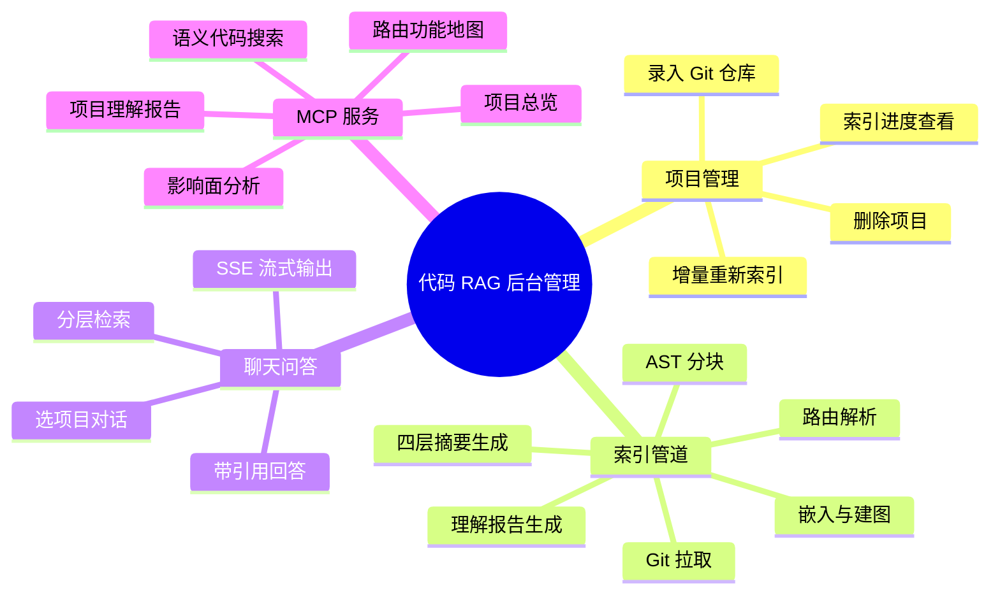
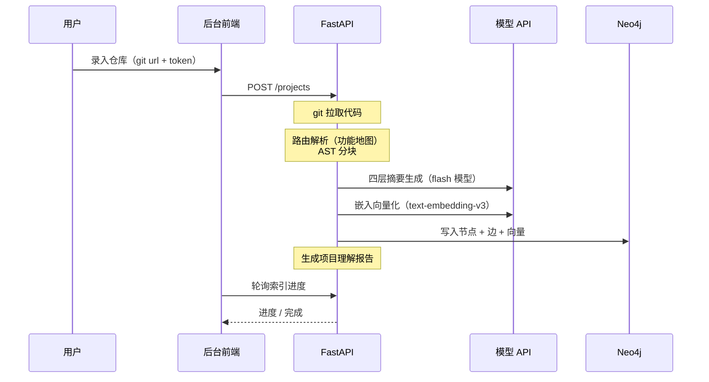
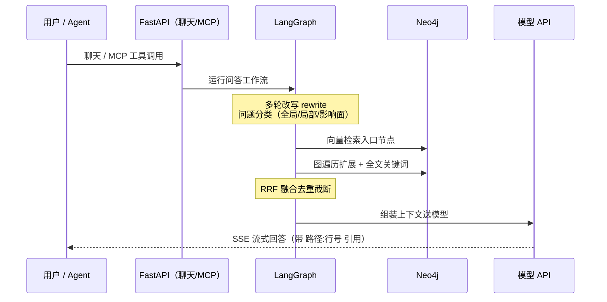

# RAG Coder — 代码 RAG 后台管理系统设计文档

- 日期：2026-08-11
- 状态：待审阅
- 用户：Peco（个人自用）

## 1. 背景与目标

做一个代码 RAG 后台管理系统：拉取 GitLab/GitHub 仓库，通过「路由分块 + AST 分块」解析代码并构建知识图谱，支持在后台选择项目进行聊天问答，并通过 MCP 把代码检索能力提供给 Claude Code 等编码 agent。

核心目标：**通过代码理解整个项目**，支撑后续「加需求分析」「重构评估」类工作。

成功标准：

1. 录入一个私有全栈仓库（JS/TS 前端 + Python 后端），索引全流程自动完成
2. 能回答三类问题：全局（"这项目架构什么样"）、局部（"XX 函数在哪/干嘛的"）、影响面（"改这个接口影响哪些页面"）
3. 索引完成后自动产出「项目理解报告」：需求逻辑文档 + 功能思维导图 + 核心流程时序图
4. Claude Code 通过 MCP 接入后，能用检索工具替代自己翻仓库

## 2. 非目标（YAGNI）

- 多用户 / 鉴权 / 权限——个人自用，单用户
- Webhook 自动同步——手动触发重新索引
- 函数级精确调用图（call graph）——动态语言精确度差，用 import 边 + 模块归属近似
- LLM 实体抽取式 GraphRAG——代码结构由 tree-sitter 确定性解析，不需要
- Java/Go 等其他语言栈——首期只做 JS/TS + Python
- 自动化 E2E 测试——手动验收清单
- 部署上云——本地 Docker Compose

## 3. 已确认决策

| 维度 | 决定 |
|---|---|
| 使用场景 | 个人自用工具，无鉴权多用户 |
| 分块策略 | 路由=功能地图（前端页面路由 + 后端 API 路由）→ 文件归属功能模块 → AST 分块，块带路由/功能元数据 |
| 支持栈 | 前端：Next.js（pages/app 文件路由）、React Router v6、Vue Router；后端：FastAPI（Flask/Django 后续扩展） |
| 模型 | 嵌入 text-embedding-v3（DashScope，默认 1024 维）；问答 qwen3.7-plus / deepseek-v4-flash；全部走 OpenAI 兼容接口，base_url/model 环境变量配置 |
| 核心框架 | LlamaIndex（摄入/索引/检索、PropertyGraphIndex）+ LangGraph（问答编排） |
| 图存储 | Neo4j（社区版）：代码属性图 + 节点向量索引 + 全文索引 |
| 业务存储 | Postgres（不装 pgvector）：项目/任务/聊天/报告，alembic 迁移 |
| MCP | FastMCP 以 streamable-http 挂载于 FastAPI `/mcp`，供 Claude Code 等接入 |
| 仓库 | GitLab/GitHub 私有仓（token，Fernet 加密存储），手动触发增量重新索引 |
| 部署 | Docker Compose 四容器：backend / frontend / postgres / neo4j |

## 4. 总体架构

```
┌─────────────────────────────────────────────────┐
│                Next.js 后台前端                    │
│  项目列表 │ 项目详情(理解报告) │ 聊天 │ MCP 接入页  │
└──────────────────────┬──────────────────────────┘
                       │ HTTP / SSE
┌──────────────────────▼──────────────────────────┐
│              FastAPI 后端（单进程）                │
│  ┌───────────┐ ┌───────────┐ ┌──────────────┐   │
│  │ 管理 API   │ │ 聊天 API   │ │ MCP(FastMCP) │   │
│  │ /projects │ │ /chat SSE │ │ /mcp         │   │
│  └─────┬─────┘ └─────┬─────┘ └──────┬───────┘   │
│        │             └────────┬─────┘           │
│  ┌─────▼──────────┐  ┌────────▼──────────────┐  │
│  │ 索引管道        │  │ 检索服务（聊天/MCP 共享） │  │
│  │ (进程内后台任务) │  │ LangGraph 问答工作流    │  │
│  │ git→路由→AST   │  │ 向量+图扩展+关键词       │  │
│  │ →摘要→嵌入→建图 │  │ RRF 融合               │  │
│  │ →理解报告       │  └───────────────────────┘  │
│  └────────────────┘                             │
└───────┬──────────────┬─────────────┬────────────┘
        │              │             │
 ┌──────▼─────┐ ┌──────▼──────┐ ┌────▼─────────────┐
 │ data/repos/│ │  Postgres   │ │      Neo4j       │
 │ 仓库本地副本 │ │ 业务数据     │ │ 代码图+向量+全文   │
 └────────────┘ └─────────────┘ └──────────────────┘

外部服务：DashScope（text-embedding-v3）、Qwen/DeepSeek（OpenAI 兼容问答）
```

要点：

- **单体后端**：索引管道跑在 FastAPI 进程内（asyncio 后台任务），单用户一次索引一个项目，不引入 Celery/Redis
- **聊天与 MCP 共享同一个检索服务层**，只维护一套检索逻辑
- 仓库 clone 到 `data/repos/<project_id>/`（Docker volume）

### 目录结构（monorepo）

```
RAG_coder/
├── backend/
│   ├── app/
│   │   ├── api/            # 管理/聊天路由
│   │   ├── core/           # 配置、加密、模型客户端工厂
│   │   ├── models/         # SQLAlchemy 模型
│   │   ├── services/
│   │   │   ├── ingest/     # git、路由解析、AST 分块、摘要、嵌入、建图
│   │   │   ├── retrieval/  # 检索服务（聊天与 MCP 共享）
│   │   │   ├── qa/         # LangGraph 问答工作流
│   │   │   └── report/     # 项目理解报告生成
│   │   └── mcp_server/     # FastMCP 工具定义
│   ├── alembic/
│   ├── tests/
│   └── pyproject.toml      # uv 管理
├── frontend/               # Next.js
├── data/repos/             # 仓库副本（volume，不入 git）
├── docker-compose.yml
└── docs/superpowers/specs/
```

核心依赖：fastapi、sqlalchemy + alembic、llama-index（core / graph-stores-neo4j / embeddings-dashscope 或 openai-like）、langgraph + langchain-openai、tree-sitter（python/javascript/typescript 语言包）、GitPython、mcp（FastMCP）、cryptography（Fernet）。版本实施时取最新稳定。

## 5. 代码理解层（索引时的整体解析）

只切块存库回答不了"需求和逻辑"级问题。索引时自底向上构建四层理解产物，**每层都嵌入进 Neo4j 向量索引**：

```
L4 项目总览（1 份/项目）  ← README + 路由地图 + 全部模块摘要汇总生成
L3 模块/路由摘要（1 份/模块）← 模块内文件摘要 + 路由入口代码生成：
                             业务目标、入口、涉及文件、数据流转
L2 文件摘要（1 份/文件）   ← 符号清单 + 头部注释 + 导入关系生成职责描述
L1 代码块（函数/类/组件）  ← tree-sitter AST 切块，原文存储
```

### 5.1 路由解析（功能地图）

- **Next.js**：pages/ 与 app/ 目录文件路由
- **React Router v6**：`<Route>` / `createBrowserRouter` 配置
- **Vue Router**：routes 配置数组
- **FastAPI**：`@app.get` / `@router.post` 装饰器 + `include_router` prefix 拼接
- 产出：`Module`（功能模块）节点 + `CONTAINS` 边。无法识别框架时**降级为按顶层目录划分模块**并标记 warning
- 文件归属：路由入口文件直接归属；非入口文件按 import 可达性归属最近模块；公共代码归 `shared` 模块（可属多模块）

### 5.2 AST 分块

- tree-sitter 解析 python / javascript / typescript / tsx
- 切块单位：函数、类（超长类按方法二次切）、组件；模块级零散语句合并为一个块
- 超大块按 token 上限二次切分，携带同一符号元数据
- 无法解析的文件（语法错误/二进制/超大）跳过并计入 stats.skipped

### 5.3 上下文增强嵌入（contextual embedding）

L1 块不裸嵌入，拼上下文头后嵌入（存储时原文与嵌入文本分离）：

```
[项目: xxx | 模块: 订单管理(/orders) | 文件: api/orders.py | 符号: create_order]
[文件职责: 订单的增删改查 API]
<原始代码>
```

### 5.4 摘要生成与成本控制

- 摘要用便宜快的模型（deepseek-v4-flash 档），300 文件项目约 340 次调用，成本几毛到一两块
- 增量重索引：git pull 后 diff 变更文件 → 只重算其 L1/L2 → 受影响模块重算 L3 → L4 重算一次
- 嵌入按 content_hash 缓存，断点续跑不重复计费
- 摘要失败降级为符号清单占位，不阻塞管道

## 6. Neo4j 代码属性图 + PropertyGraphIndex

### 6.1 图 Schema

```cypher
// 节点（全部带 project_id 属性做项目隔离）
(:Project {id, name, git_url, summary})                  // L4
(:Module  {name, route_prefix, kind, summary})           // L3（kind: page/api/shared）
(:File    {path, language, summary, content_hash})       // L2
(:Chunk   {symbol, symbol_type, code, context_text,      // L1
           start_line, end_line, embedding})

// 边
(Project)-[:HAS_MODULE]->(Module)
(Module)-[:CONTAINS]->(File)       // 路由归属，文件可属多模块
(File)-[:DEFINES]->(Chunk)
(File)-[:IMPORTS]->(File)          // tree-sitter 解析 import/require
(Chunk)-[:CALLS_API]->(Chunk)      // 前端 fetch/axios ↔ 后端 handler
```

- Module/File 的 summary 也做嵌入，全局问题直接命中摘要层节点
- 向量索引维度按嵌入模型配置（text-embedding-v3 默认 1024），环境变量控制
- `CALLS_API` 匹配规则：提取前端 fetch/axios 的 URL 字面量与简单模板串，规范化后与后端路由表做路径参数模式匹配（`/orders/${id}` ↔ `/orders/{id}`）；动态拼接 URL 不保证，记 warning

### 6.2 建图方式

不用 LLM 抽取器。tree-sitter / 路由解析器确定性产出节点与边，经 PropertyGraphIndex 手动插入接口（`insert_nodes` + `EntityNode`/`Relation`）写图。LLM 只生成各层 summary 文本。

### 6.3 检索流水线

```
提问
 ├─ VectorContextRetriever   ← 向量命中入口节点（任意层）+ 图遍历邻居(depth 1~2)
 ├─ 关键词 Retriever（自定义）← Neo4j 全文索引，精确匹配函数名/标识符
 └─ 影响面查询（Cypher 模板） ← "改 X 影响什么"类问题走多跳遍历
      ↓
  RRF 融合去重 → 截断 → LangGraph
```

### 6.4 LangGraph 问答工作流

节点：`rewrite`（多轮对话中把 follow-up 改写为独立问题）→ `classify`（全局/局部/影响面）→ `retrieve`（按类别选检索策略）→ `generate`（组装上下文，qwen3.7-plus / deepseek-v4-flash 生成，SSE 流式，输出引用 `文件路径:行号`）。会话历史取最近 N 轮（默认 6）。

### 6.5 增量重索引（图局部重建）

diff 变更文件 → Cypher 删除对应 File 及 DEFINES 子图 → 重解析重嵌入插回 → 重连 IMPORTS / CALLS_API 边 → 受影响 Module 重算摘要 → 报告局部更新。按 commit sha + file hash 幂等。

## 7. 项目理解报告（对目标代码自动生成）

索引管道最后一阶段（report）自动生成，存 `understanding_reports` 表，项目详情页「项目理解」页签展示，MCP 可取。三件套：

1. **需求逻辑文档**（Markdown）：项目实现的业务需求（按模块组织）；每模块的业务目标、关键逻辑、入口路由、核心文件；技术栈与架构总结。LLM 基于 L4/L3 + 路由地图生成
2. **功能思维导图**（Mermaid mindmap）：项目→模块→路由/页面三层树。**程序化生成**（数据来自图，零幻觉），模块业务命名取自 L3 摘要
3. **核心流程时序图**（Mermaid sequenceDiagram，每核心模块一张）：页面/组件→HTTP→handler→服务→DB 真实链路。骨架来自 CALLS_API + IMPORTS 边，LLM 翻译为时序图并标注语义。**生成后做 mermaid 语法校验，失败重试一次，再失败降级为文字链路列表**（不阻塞索引完成）

选 Mermaid 的理由：前端可渲染、源码可复制进任何文档、可版本管理、agent 直接读懂。

增量重索引后只重新生成受影响模块的时序图与文档章节。

## 8. Postgres 数据模型

```sql
projects              -- 项目注册表
  id uuid pk, name, git_url,
  git_token_encrypted,          -- Fernet 加密，密钥来自环境变量 SECRET_KEY
  default_branch,
  status,                       -- pending | indexing | ready | failed
  last_indexed_commit, created_at, updated_at

index_jobs            -- 索引任务与进度（前端轮询）
  id, project_id fk, kind,      -- full | incremental
  status,                       -- running | succeeded | failed
  stage,                        -- clone|parse|summarize|embed|graph|report
  progress int,                 -- 0-100
  stats_json,                   -- 文件数/块数/跳过数/token 消耗
  error_text, started_at, finished_at

chat_sessions
  id, project_id fk, title, created_at

chat_messages
  id, session_id fk, role, content,
  citations_json,               -- [{file_path, start_line, end_line, node_id}]
  created_at

understanding_reports
  id, project_id fk, doc_markdown, mindmap_mermaid,
  sequences_json,               -- [{module, mermaid, fallback_text}]
  generated_at
```

## 9. MCP 工具（7 个）

FastMCP 挂载于 `/mcp`（streamable-http）。设计原则：返回精简 JSON + `路径:行号` 定位；top_k / 分页限制防上下文爆炸；与聊天共用检索服务层。

| 工具 | 作用 |
|---|---|
| `list_projects()` | 已录入项目清单 + 技术栈 + 状态 |
| `get_project_overview(project)` | L4 总览 + 模块列表 |
| `get_module_map(project)` | 路由功能地图（JSON + mermaid） |
| `search_code(project, query, module?, top_k)` | 混合检索代码块，返回路径:行号 + 模块 + 代码 |
| `get_file_summary(project, path)` | L2 文件摘要 + 符号清单 |
| `impact_analysis(project, symbol_or_path)` | 图多跳：被谁依赖 / 哪些前端调用 / 波及哪些路由 |
| `get_project_understanding(project)` | 第 7 节全套理解报告 |

## 10. 后台界面（Next.js）

1. **项目列表页 `/`**：项目卡片（名称/技术栈/状态徽章/最后索引时间）；索引中显示六阶段进度条；「录入项目」弹窗（git url + token 可选 + 分支）；操作：详情/重新索引/删除（二次确认）
2. **项目详情页 `/projects/[id]`**：页签「项目理解」（报告三件套，mermaid 渲染+源码复制）、「功能地图」（模块→文件→L2 摘要）、「索引记录」（历次任务/统计/错误）
3. **聊天页 `/projects/[id]/chat`**：左侧会话列表；SSE 流式 markdown；回答下方引用卡片（路径:行号 + 折叠代码预览）
4. **MCP 接入页**：MCP URL + Claude Code 配置片段

## 11. 错误处理

原则：单点失败不报废全局，一切可重试。

| 故障 | 对策 |
|---|---|
| git 拉取失败 | 任务 failed + error_text 展示，可重试 |
| 路由框架不识别 | 降级按顶层目录划分模块，标 warning，继续 |
| 单文件解析失败 | 跳过，计入 stats.skipped |
| LLM 摘要限流/超时 | 指数退避重试 3 次 → 符号清单占位，任务标 partial |
| 嵌入限流 | 批量 + 并发上限 + 退避；content_hash 缓存断点续跑 |
| 进程重启丢任务 | 任务标 stale 可重触发；增量索引幂等 |
| 项目未就绪提问 | 明确提示，不给幻觉回答 |
| mermaid 语法错误 | 校验 + 重试 1 次 + 文字降级 |

## 12. 测试策略

- **解析器单测（重点）**：路由解析器（Next.js/React Router/Vue Router/FastAPI 各配 fixture）、AST 分块器（各语言样例断言切块边界与元数据）
- **管道集成测试**：10 余文件微型全栈 fixture 仓库跑完整索引，断言 Neo4j 节点/边数量、CALLS_API 连接正确
- **检索冒烟**：fixture 的 5-8 个标准问题（全局/局部/影响面）断言命中预期节点
- LLM 全 mock、嵌入用固定假向量；E2E 手动验收清单

## 13. 里程碑

- **M1 最细直线跑通**：Compose 四容器 + 项目 CRUD + git 拉取 + AST 分块 + 嵌入 + Neo4j 写入 + 最简向量检索聊天 → 能问"XX 函数在哪"（先验证 tree-sitter / Neo4j / LlamaIndex 集成风险）
- **M2 理解层**：路由解析 + 四层摘要 + contextual embedding + 分层检索 + 图扩展 → 能问"登录流程怎么实现"
- **M3 报告 + MCP**：理解报告 + 7 个 MCP 工具 + Claude Code 实测接入
- **M4 打磨**：增量重索引 + 影响面 Cypher 多跳 + 引用溯源 UI + 错误处理补全

## 附录 A：本系统功能导图（mermaid 源码）



## 附录 B：录入索引链路时序图（mermaid 源码）



## 附录 C：问答检索链路时序图（mermaid 源码）


